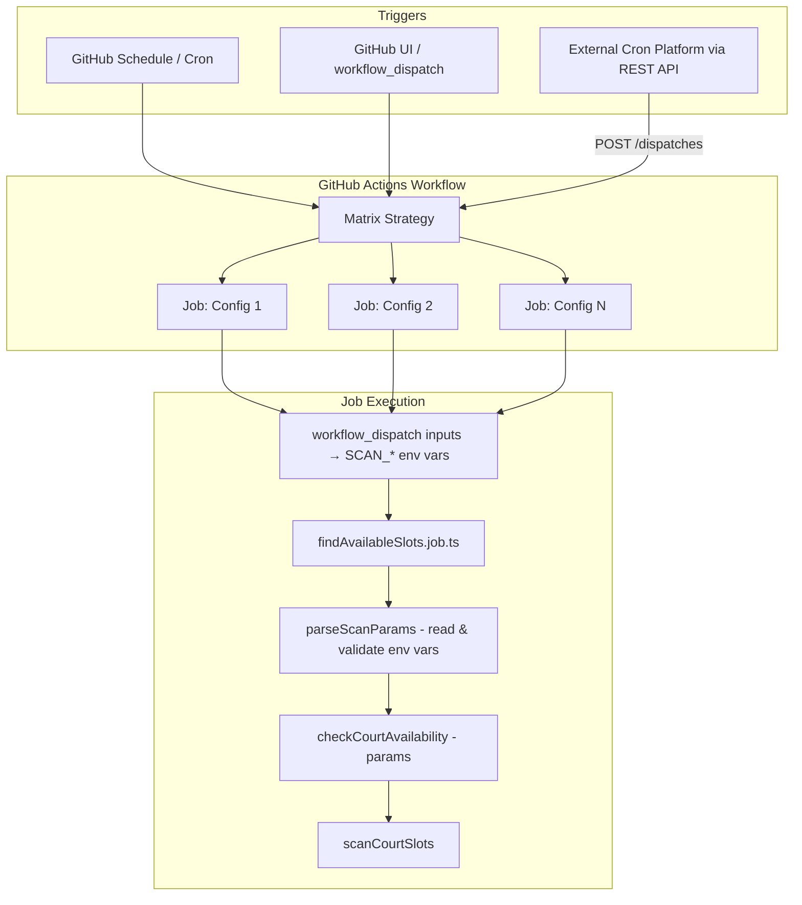

# Design Document: Parameterized Court Scan

## Overview

This design externalizes the hardcoded scan parameters in `findAvailableSlots.service.ts` so they can be configured via environment variables and GitHub Actions workflow inputs. The changes enable:

1. A new `parseScanParams()` function that reads and validates environment variables, returning a `ScanCourtSlotsOptions` object.
2. The job entry point (`findAvailableSlots.job.ts`) calls `parseScanParams()`, passes the result to `checkCourtAvailability(params)`, and exits — no more `node-cron`.
3. The GitHub Actions workflow gains `workflow_dispatch` inputs, a matrix strategy for parallel scans, and a `schedule` trigger — all mapping inputs to `SCAN_*` environment variables.

External cron platforms (e.g., cron-job.org) can trigger scans via the GitHub Actions `workflow_dispatch` REST API, passing custom parameters as JSON inputs.

## Architecture



The data flow is linear: trigger → workflow → matrix jobs → env vars → `parseScanParams()` → `checkCourtAvailability(params)` → `scanCourtSlots(params)`.

## Components and Interfaces

### 1. `parseScanParams()` — new function in `src/utilities/scanParams.util.ts`

Reads `SCAN_*` environment variables, applies defaults, validates, and returns `ScanCourtSlotsOptions`.

```typescript
/**
 * Reads SCAN_* environment variables, applies defaults, validates,
 * and returns a ScanCourtSlotsOptions object.
 * Throws with a descriptive message on invalid input.
 */
export function parseScanParams(
  env?: Record<string, string | undefined>,
): ScanCourtSlotsOptions;
```

Accepts an optional `env` parameter (defaults to `process.env`) to make the function pure and testable.

**Environment variable mapping:**

| Env Var                  | Default | Maps to                                                |
| ------------------------ | ------- | ------------------------------------------------------ |
| `SCAN_START_DATE_OFFSET` | `1`     | `startDate = today + offset days`                      |
| `SCAN_END_DATE_OFFSET`   | `1`     | `endDate = today + offset days`                        |
| `SCAN_START_HOUR`        | `10`    | `startHour`                                            |
| `SCAN_END_HOUR`          | `19`    | `endHour`                                              |
| `SCAN_SKIP_WEEKEND`      | `false` | `skipWeekend`                                          |
| `SCAN_SKIP_WEEKDAYS`     | `""`    | `skipWeekdays` (parsed as comma-separated day numbers) |

### 2. `checkCourtAvailability(params)` — modified in `src/services/findAvailableSlots.service.ts`

The function signature changes from `() => Promise<void>` to `(params: ScanCourtSlotsOptions) => Promise<void>`. All inline parameter construction is removed.

### 3. `findAvailableSlots.job.ts` — modified entry point

```typescript
// Simplified: no cron, single execution
import { parseScanParams } from "@src/utilities/scanParams.util";
import { checkCourtAvailability } from "@services/findAvailableSlots.service";

async function main(): Promise<void> {
  const params = parseScanParams();
  await checkCourtAvailability(params);
}

main().catch((err) => {
  console.error(err);
  process.exit(1);
});
```

### 4. GitHub Actions Workflow — `.github/workflows/notify-court.yml`

Key changes:

- `workflow_dispatch.inputs` for all six scan parameters (all optional, string type).
- `schedule` trigger with a cron expression.
- `matrix` strategy with an array of scan configuration objects.
- Each matrix entry gets a unique cache key (`court-cache-${{ matrix.config.name }}-...`) and artifact name (`slot_history-${{ matrix.config.name }}`).
- Inputs override matrix values when provided via `workflow_dispatch`.

```yaml
on:
  schedule:
    - cron: "*/5 6-21 * * 0-4" # Example: every 5 min, Sun-Thu, 6am-9pm
  workflow_dispatch:
    inputs:
      start_date_offset:
        description: "Days from today for scan start date"
        required: false
      end_date_offset:
        description: "Days from today for scan end date"
        required: false
      start_hour:
        description: "Start hour (0-23)"
        required: false
      end_hour:
        description: "End hour (1-24)"
        required: false
      skip_weekend:
        description: "Skip weekend days (true/false)"
        required: false
      skip_weekdays:
        description: "Comma-separated day numbers to skip (0=Sun..6=Sat)"
        required: false

jobs:
  check-court:
    runs-on: ubuntu-latest
    timeout-minutes: 10
    strategy:
      matrix:
        config:
          - name: weekday-evening
            start_date_offset: "1"
            end_date_offset: "14"
            start_hour: "19"
            end_hour: "23"
            skip_weekend: "true"
            skip_weekdays: ""
          - name: weekend-daytime
            start_date_offset: "1"
            end_date_offset: "14"
            start_hour: "10"
            end_hour: "19"
            skip_weekend: "false"
            skip_weekdays: "0,1,2,3,4"
```

For `workflow_dispatch` triggers, the workflow uses an expression like:

```yaml
env:
  SCAN_START_HOUR: ${{ inputs.start_hour || matrix.config.start_hour }}
```

This lets dispatch inputs override matrix defaults, while scheduled runs use matrix values directly.

## Data Models

### Existing: `ScanCourtSlotsOptions` (no changes needed)

```typescript
export interface ScanCourtSlotsOptions {
  startDate: Date;
  endDate: Date;
  startHour: number;
  endHour: number;
  skipWeekend?: boolean;
  skipWeekdays?: number[];
}
```

This interface already captures everything needed. `parseScanParams()` constructs this from env vars.

### Validation Rules (enforced by `parseScanParams`)

| Parameter                | Type                 | Valid Range           | Default   |
| ------------------------ | -------------------- | --------------------- | --------- |
| `SCAN_START_DATE_OFFSET` | non-negative integer | `>= 0`                | `1`       |
| `SCAN_END_DATE_OFFSET`   | non-negative integer | `>= 0`                | `1`       |
| `SCAN_START_HOUR`        | integer              | `0–23`                | `10`      |
| `SCAN_END_HOUR`          | integer              | `1–24`                | `19`      |
| `SCAN_SKIP_WEEKEND`      | boolean string       | `"true"` or `"false"` | `"false"` |
| `SCAN_SKIP_WEEKDAYS`     | comma-separated ints | each `0–6`            | `""`      |

Cross-field rules:

- `SCAN_START_HOUR < SCAN_END_HOUR`
- `SCAN_START_DATE_OFFSET <= SCAN_END_DATE_OFFSET`
